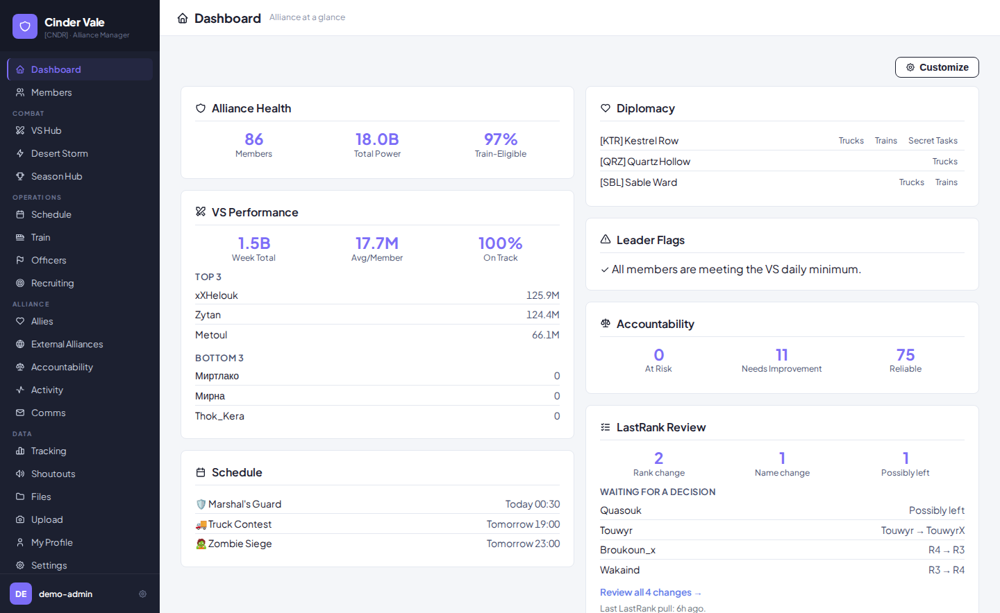
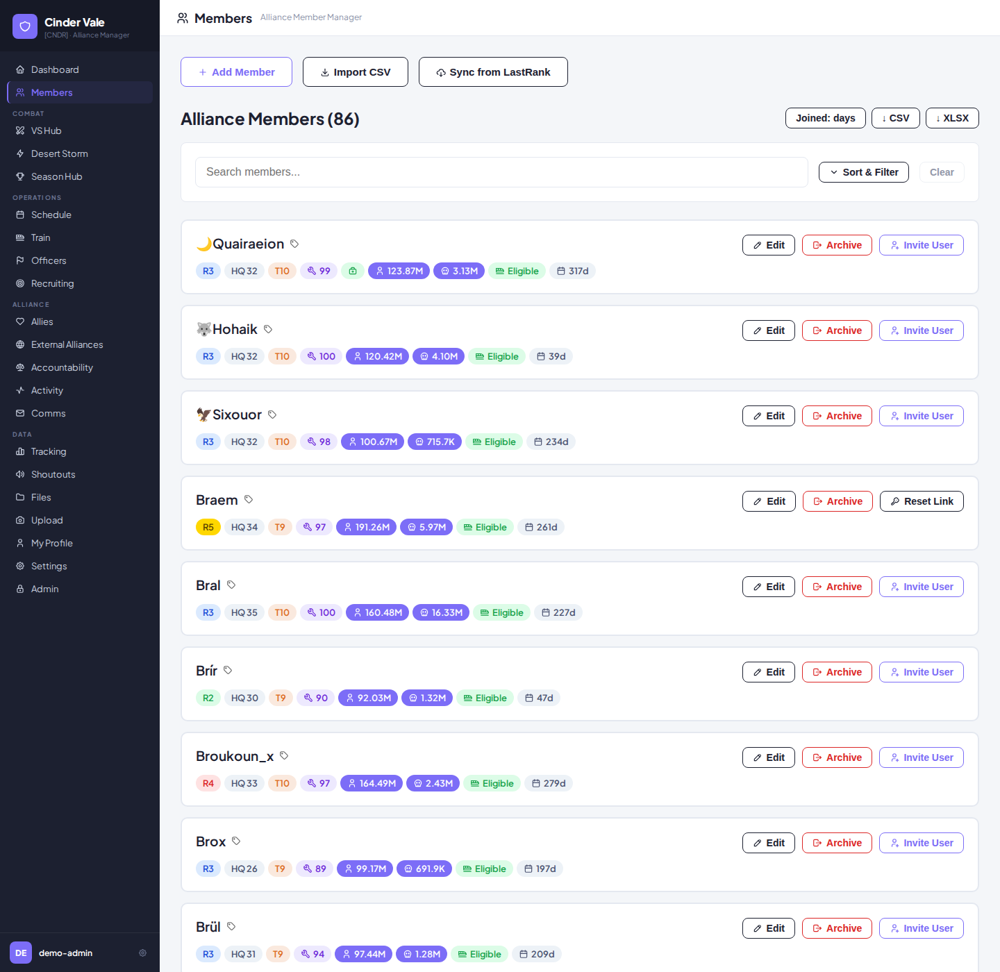
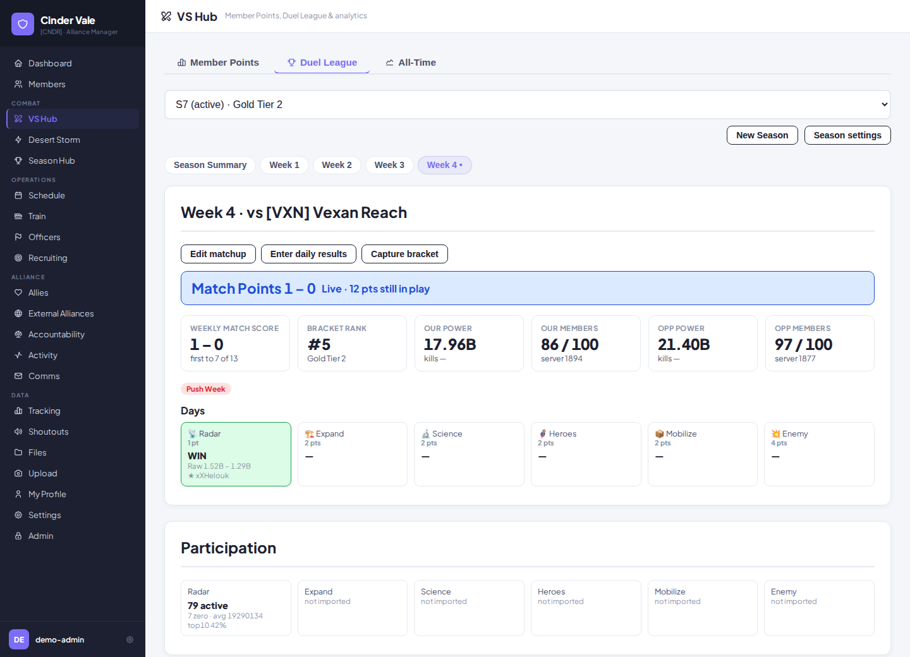
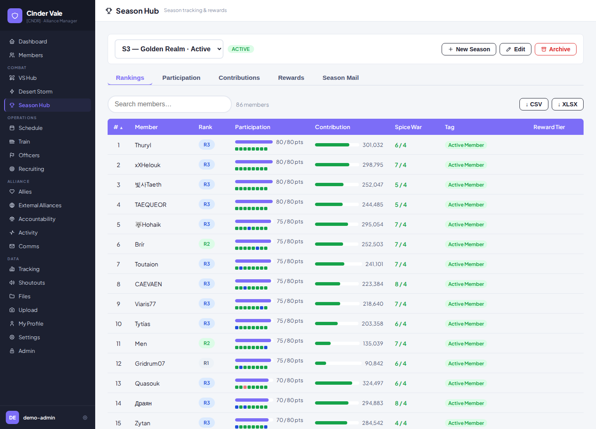
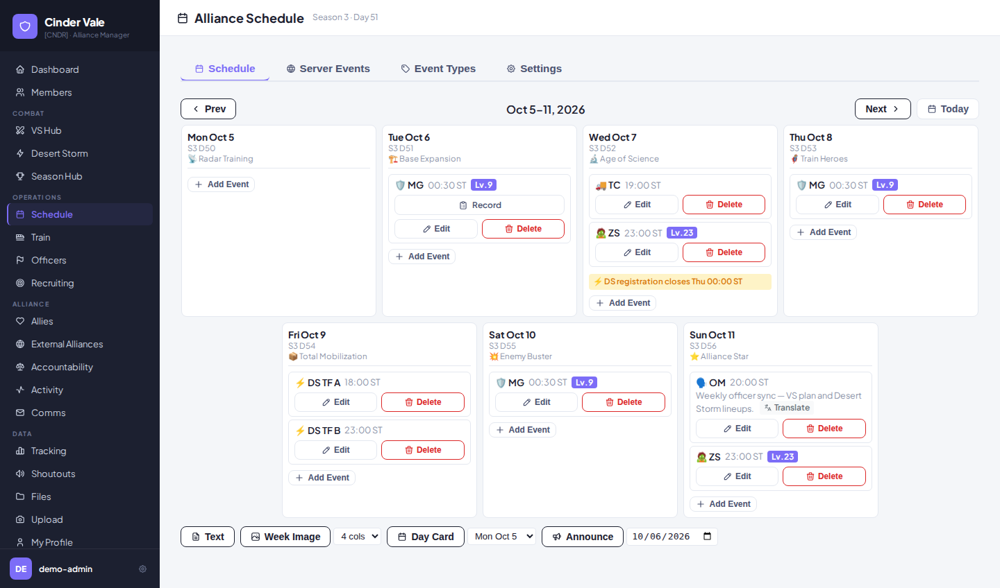
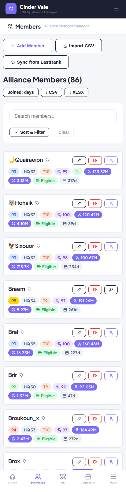
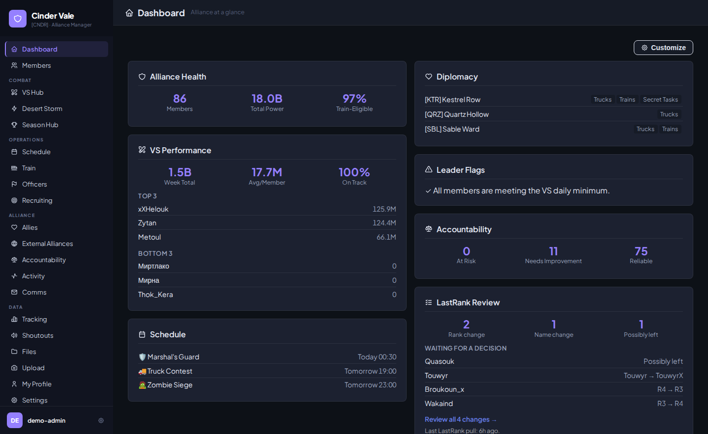

# Last War: Survival — Alliance Manager

[](https://github.com/shodiwarmic/lastwar-alliance-manager/actions/workflows/build-check.yml)
[](https://github.com/shodiwarmic/lastwar-alliance-manager/releases/latest)
[](LICENSE)

A comprehensive, self-hosted web application for managing your alliance in the online game Last War: Survival. Track member growth, monitor VS Duel activity, plan Desert Storm, host alliance documents, and share feedback — all deployed via Docker.

Everything is permission-gated by in-game rank (R1–R5), so officers see what they need and members see what concerns them.

---

## What it does

| | |
|---|---|
| ⚙️ **Core Management** | Roster, ranks and aliases, with rank-based permissions, session security and configurable password policy |
| 🏠 **Overview Dashboard** | A landing page each user arranges themselves, from cards for alliance health, VS performance and what needs attention |
| 📈 **Analytics & Activity** | Power, hero power, troop kills and HQ level tracked over time, with a full audit log of who changed what |
| 🗡️ **VS Duel League** | Match-point scoring, its own season numbering, weekly matchups and per-member contribution |
| 📢 **Shoutouts & Feedback** | Semi-anonymous member feedback with targeted visibility and an audited anonymity override |
| 🤝 **Allies & Diplomacy** | Ally directory, agreement-type registry, and a non-aggression pact ladder synced from LastRank |
| 🌩️ **Desert Storm Planner** | Task-force setup, member registration, group and building assignment, and battle mail |
| 🗓️ **Alliance Schedule** | Shared calendar of recurring and one-off alliance events |
| 🎖️ **Officer Command** | Who is responsible for what, by category, with assignee tracking |
| 🎯 **Recruiting** | Prospects and transfers, former-member reactivation, and LastRank player lookup |
| 🏆 **Season Hub** | Season lifecycle, rankings, participation, contribution tracking and reward tiers |
| 📬 **Alliance Communications** | Reusable mail and announcement templates with a variable system, plus polls |
| ⚖️ **Member Accountability** | Tags, a hybrid strike system, excused absences and no-show tracking |
| 🚂 **Train Tracker** | Eligibility rule engine, conductor log and rotation fairness |
| 📁 **Alliance Files** | Live collaborative document editing, image hosting and tagged file storage |
| 📸 **Smart OCR Extraction** | Read rankings straight from game screenshots — cloud (Cloud Vision) or a local, no-dependency backend |
| 🌐 **Inline Translation** | Translate a single member-written note in place, without translating the whole page |

**→ [Full feature list](docs/FEATURES.md)** — every feature in detail, with the permission each one needs.

## Screenshots

*A fictional alliance — every name and number in these pictures is generated.*



| | |
|---|---|
|  |  |
|  |  |
|  |  |

---

## Quick install

Debian/Ubuntu. The script checks the host, installs Docker, generates secrets, configures Caddy with SSL, and pulls the pre-built containers. Install into any directory you like:

```bash
mkdir -p ~/alliance-manager && cd ~/alliance-manager      # any directory you like
curl -fsSL -o host-files.tar.gz \
  https://github.com/shodiwarmic/lastwar-alliance-manager/releases/latest/download/host-files.tar.gz
tar -xzf host-files.tar.gz && rm host-files.tar.gz
./scripts/install.sh
```

You will need a Linux server and two DNS records pointing at it — one for the app, one for the document server. No Go, OCR libraries or SQLite on the host: the stack runs from pre-built images.

## Documentation

| Guide | What's in it |
|---|---|
| [FEATURES.md](docs/FEATURES.md) | The complete feature list, with permissions |
| [QUICKSTART.md](docs/QUICKSTART.md) | The short path from a fresh host to a running install, plus troubleshooting |
| [DEPLOYMENT.md](docs/DEPLOYMENT.md) | Full production setup — DNS, Docker, reverse proxy, environment variables, backups, updates |
| [IMAGE_RECOGNITION.md](docs/IMAGE_RECOGNITION.md) | The OCR pipeline, both backends, and optional request archival |
| [DESIGN_STANDARD.md](docs/DESIGN_STANDARD.md) | UI design standard — tokens, components, icon system |
| [RELEASING.md](docs/RELEASING.md) | How versions are numbered and cut, and what each release level promises an operator |

Released versions and what changed in each are listed in [CHANGELOG.md](CHANGELOG.md). Installs
run a pinned release (`APP_VERSION` in `.env`) and can be rolled back to an earlier one.

Configuration is via a `.env` file — copy `.env.example` and fill it in. Every variable is documented in [DEPLOYMENT.md](docs/DEPLOYMENT.md).

## First login

A fresh install has **no account and no default password**. Instead the app writes a one-time
setup key to `data/setup-key` in the install directory, and every page sends you to `/setup`
until the first administrator is created with it:

```bash
sudo cat data/setup-key
```

The key is valid for 24 hours and works once. If it has expired, delete the file and restart the
app (`docker compose restart alliance-manager`) to issue a new one.

---

## Security Architecture

- **Encrypted Credentials**: External API credentials (like GCP Service Accounts) are symmetrically encrypted at rest using AES-GCM. The application employs strict memory hygiene, zeroing out sensitive plaintext buffers immediately after cryptographic operations or API transmissions to prevent memory scraping.
- **Isolated Internal Networking**: The Go application and the Collabora document server communicate exclusively over a private Docker bridge (`lastwar-net`), preventing external data exposure.
- **CSRF Protection**: Every state-changing request (anything but GET/HEAD/OPTIONS) from a browser is rejected unless it is same-origin, checked with the browser's Fetch-metadata `Sec-Fetch-Site` header and falling back to `Origin` versus `Host`.
- **Content-Security-Policy**: The automated Caddy setup configures strict CSP headers on both domains. The main app uses `frame-src` and `connect-src` to restrict iframes and WebSocket connections exclusively to your Collabora subdomain. The Collabora server uses `frame-ancestors` to ensure it can *only* be embedded within your Alliance Manager domain.
- **Password Hashing**: Passwords are exclusively hashed with bcrypt before storage, accompanied by strict server-side complexity enforcement.
- **WOPI JWT**: Document editing sessions are secured with short-lived JSON Web Tokens.
- **Volume Persistence**: Databases and uploads are stored in persistent Docker volumes, surviving container rebuilds while remaining inaccessible to the public web root.

---

## License

Released under the [MIT License](LICENSE). This project inherits its licence from the upstream repository it was forked from, whose copyright notice is retained in the `LICENSE` file alongside one for the divergent work.

---

## Credits & Acknowledgements

This project originated as a fork of [`vervelak/lastwar-alliance-manager`](https://github.com/vervelak/lastwar-alliance-manager). The original repository provided the foundation that this project was built upon, and we are grateful to its author for starting it. The codebases have since diverged significantly — features, architecture, and deployment have all evolved independently — but the original work deserves full credit for getting this started.
